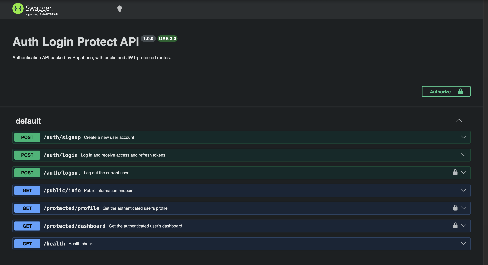

# Auth Login Protect API

A lightweight authentication API built with Express and [Supabase Auth](https://supabase.com/docs/guides/auth). It exposes signup/login/logout routes backed by Supabase, a public endpoint, and JWT-protected endpoints guarded by a bearer-token middleware. Interactive API docs are served via Swagger UI.

## Setup

1. Install dependencies:

   ```bash
   npm install
   ```

2. Create a `.env` file in the project root based on `.env.example`:

   ```bash
   cp .env.example .env
   ```

3. Fill in the required environment variables:

   | Variable | Description |
   |---|---|
   | `SUPABASE_URL` | Your Supabase project URL (found in Project Settings → API). |
   | `SUPABASE_KEY` | Your Supabase project's anon/public API key. |
   | `PORT` | Port the server listens on (defaults to `3000` if unset). |

## Running

```bash
npm start
```

The server starts on `http://localhost:3000` (or your configured `PORT`). Interactive API documentation is available at `http://localhost:3000/docs`.

For local development with auto-restart on file changes, use `npm run dev` instead.

## API Reference

| Method | Endpoint | Auth Required | Description |
|---|---|:---:|---|
| POST | `/auth/signup` | No | Create a new user account |
| POST | `/auth/login` | No | Log in and receive access and refresh tokens |
| POST | `/auth/refresh` | No | Exchange a refresh token for a new access token |
| POST | `/auth/logout` | Yes | Log out the current user |
| GET | `/public/info` | No | Public information endpoint |
| GET | `/protected/profile` | Yes | Get the authenticated user's profile |
| GET | `/protected/dashboard` | Yes | Get the authenticated user's dashboard |
| GET | `/health` | No | Health check |

Protected routes require an `Authorization: Bearer <access_token>` header, using the `access_token` returned from `/auth/login`.

## API Documentation

Swagger UI is served at `/docs` and lets you authorize with a bearer token to try protected routes directly in the browser.



## What's inside a JWT (notes)

I logged in through `/auth/login`, grabbed the `access_token` it gave back, and pasted it into [jwt.io](https://jwt.io) to see what was actually inside. Here's what came out:

```json
// header
{
  "alg": "ES256",
  "kid": "b43ef98f-3665-4aa7-a117-cf8eed5030e7",
  "typ": "JWT"
}

// payload
{
  "iss": "https://<project-ref>.supabase.co/auth/v1",
  "sub": "f8cdce87-3ce0-4498-849c-8bf4a35887f0",
  "aud": "authenticated",
  "exp": 1786894442,
  "iat": 1786890842,
  "email": "test@example.com",
  "role": "authenticated",
  "aal": "aal1",
  "amr": [{ "method": "password", "timestamp": 1786890842 }],
  "session_id": "2b3ee291-9e2b-41c8-8b5b-f9fc74819cab",
  "is_anonymous": false
}
```

So a JWT is basically just an ID card for the session: who you are (`sub`, `email`), what you're allowed to do (`role`), and when it was issued and when it expires (`iat`, `exp`). The part that surprised me is that jwt.io didn't need any password or secret key to show me all this — it just base64-decoded the payload — which means a JWT isn't actually hidden from anyone who gets a copy of it, so you should never stash real secrets in there. The only thing keeping someone from forging their own token is the signature at the end, which only the server (with the signing key) can produce.

## The expiry experiment (notes)

Doing the math on the token above: `exp` (`1786894442`) minus `iat` (`1786890842`) is exactly `3600` seconds — Supabase's default one-hour access token lifetime.

The plan: log in, save the `access_token`, wait an hour, then hit `/protected/profile` again with that same stale token:

```bash
curl http://localhost:3000/protected/profile \
  -H "Authorization: Bearer <expired-access-token>"
```

`requireAuth` (see [authMiddleware.js](authMiddleware.js)) sends every token to `supabase.auth.getUser(token)`, and once the token is past `exp`, Supabase no longer returns a user for it — so `requireAuth` falls into its `!user` branch and responds:

```json
{ "error": "Invalid or expired token" }
```

with a `401`. Nothing about the *signature* went bad — the token is still validly signed, it's just outside its time window. That's the whole reason `/auth/login` also hands back a `refresh_token`: it's a longer-lived credential you trade in for a brand-new access token without forcing the user to type their password again every hour.

## The logout experiment (notes)

JWTs are stateless, so I figured logging out couldn't really kill a token early — the server doesn't store it anywhere, so what's left to revoke? Tested it: log in, call `/protected/profile` (works), call `/auth/logout`, then replay the *same* token on `/protected/profile` again.

| Step | Result |
|---|---|
| profile before logout | `200` |
| logout | `204` |
| profile after logout, same token | `401 Invalid or expired token` |

Rejected instantly, and `exp` still had ~59 minutes left — so it really got revoked, not expired.

Turns out my assumption was wrong for this app specifically. `requireAuth` doesn't verify the JWT itself — it calls `supabase.auth.getUser(token)` on every request, which is a network call to Supabase. Supabase keeps sessions server-side (the `session_id` claim), and `signOut()` kills that session. So logout does work here, but only because every request pays for a round trip to the auth server.

If `requireAuth` checked the signature locally instead (no network call, just verify + check `exp`), the token would keep working after logout until it naturally expired — there'd be nothing left to revoke. That's the real problem with stateless JWTs: verify locally and you can't revoke early, or check the server every time and you're not really stateless anymore.

## The refresh experiment (notes)

Access tokens die after an hour, but nobody wants to re-type their password every hour. That's what the `refresh_token` from login is for. Added a `/auth/refresh` route and tested it:

```bash
curl -X POST http://localhost:3000/auth/refresh \
  -H "Content-Type: application/json" \
  -d '{"refresh_token":"<refresh_token>"}'
```

Result: `200`, with a brand new `access_token` (different from the old one, works on `/protected/profile`) plus a new `refresh_token` too — Supabase rotates both, not just the access token.

So the refresh token is really the long-lived login, and the access token is just a short-lived pass you keep swapping out with it — no password needed until the refresh token itself expires or gets revoked.